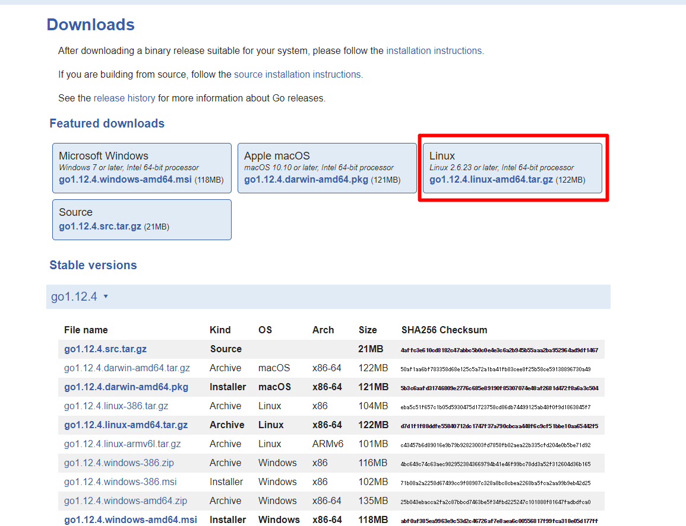
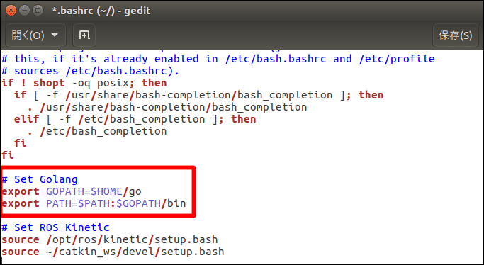

# Goのインストール

 Goはプログラミング言語の1つである。2009年、GoogleでRobert Griesemer、ロブ・パイク、ケン・トンプソンによって設計された。

 Goは、静的型付け、C言語の伝統に則ったコンパイル言語、メモリ安全性（英語版）、ガベージコレクション、構造的型付け（英語版）、CSPスタイルの並行性などの特徴を持つ。Goのコンパイラ、ツール、およびソースコードは、すべてフリーかつオープンソースである。

## ディレクトリ構成

 Go環境の基本的なディレクトリ構成を以下に示す。

| #    | 名称                   | 環境変数名 | パス                  | 備考                     |
| ---- | ---------------------- | ---------- | --------------------- | ------------------------ |
| 1    | Go本体                 | GOROOT     | /usr/local/go         |                          |
| 2    | Go関連モジュール       | GOPATH     | $HOME/go  ※           | リンクモジュール格納先   |
| 3    | Goプロジェクトフォルダ | ー         | $HOME/MyProjects    ※ | ユーザプロジェクト作業先 |

※任意

## Goインストール済み確認

 ターミナルから以下のコマンドを実行し、バージョンが正しく表示されることを確認する。

```
$ go version
```

 バージョン表示で失敗する、またはバージョンが古い場合、以下インストールを実施する。

## Goインストール

 Go未インストール時、ターミナルから以下のコマンドを実行し、インストールを実施する。

 Go未インストール時に以下を実施する。

### インストールの準備

 公式サイト（URL: [https://golang.org/dl/](https://golang.org/dl/)）より該当する実行ファイルをダウンロードする。




### 実行ファイルの展開

 ターミナルから以下のコマンドを実行し、実行ファイルを展開する。

```
$ cd [ダウンロード先]                                    ← 例：~/Download
$ sudo tar -C /usr/local/ -xzf [ダウンロードファイル名]  ← 例：go 1.12.4.linux-amd64.tar.gz
```


$HOME/.profile ファイルを開き、以下のコマンドを追記する。

```sh:.profile
export PATH=$PATH:/usr/local/go/bin
```

【追記例】

```
$ gedit ~/.profile    ← エディタ起動
```


 編集後、保存してエディタを閉じる。その後、環境変数の取込みを行うため、ターミナルから以下のコマンドを実行、またはUbuntuを再起動する。

```
$ source ~/.profile
```

 前項「Goインストール済み確認」に従い、バージョンが正しく表示されることを確認する。

## 環境変数の設定

 $HOME/.bashrc ファイルを開き、以下のコマンドを追記する。

```sh:.bashrc
export GOPATH=$HOME/go
export PATH=$PATH:$GOPATH/bin
```

【追記例】

```
$ gedit ~/.bashrc    ← エディタ起動
```



 編集後、保存してエディタを閉じる。その後、ターミナルから以下のコマンドを実行し、環境変数の取込み、およびフォルダ作成を行う。

```
$ source ~/.bashrc
$ mkdir $GOPATH
```

ターミナルから以下のコマンドを実行し、goフォルダが存在していることを確認する。

```
$ ls $HOME
```

